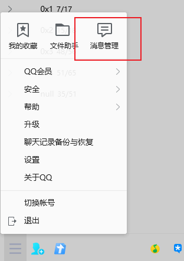

## FuckQQ

一个 QQ群 聊天记录 图片清理工具

## Step 0 火绒剑 开启监控
安装火绒后，安全工具->高级工具中打开火绒剑 

开启日志过滤，把自己QQ号加入过滤路径，格式为 你的QQ号\Image，设置完成后，开启监控

## Step 1
在 QQ->消息管理->你想清理的群聊->导出消息记录->选择以**mht**格式导出

## Step 2
导出完成后，在火绒剑中停止监控，并将日志导出到桌面，命名为 `log.txt`(其他文件名与路径需在代码中进行相应的修改)

## Step 3
运行`move_image.py`，程序会将群聊图片文件移动到"D:\qq_image_tmp"路径下，当然你也可以自行指定路径

## Step 4
如有需要，可以在整理后运行`move_back.py`，将群聊图片移动到原来的路径，需要原日志文件`log.txt`存在